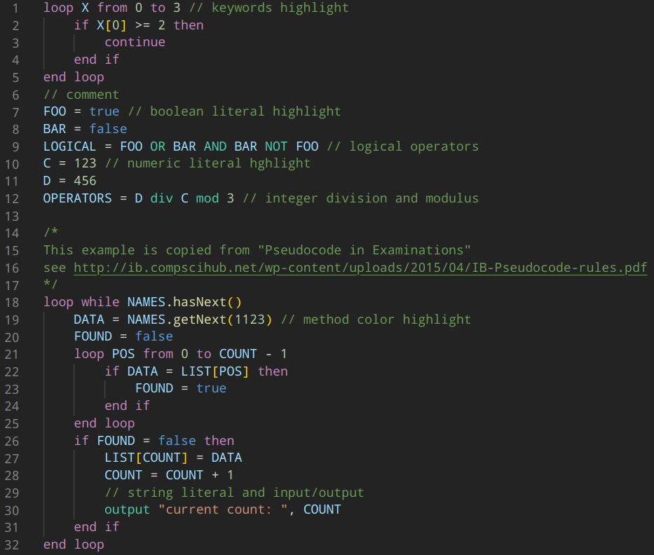

# ibcs-pseudocode

This extension provides basic syntax highlight for IB-styled pseudocode as specified in [IB Pseudocode Rules](http://ib.compscihub.net/wp-content/uploads/2015/04/IB-Pseudocode-rules.pdf).

## Features

## Requirements

VS Code

## Release Notes

### 1.0.0

Initial release
